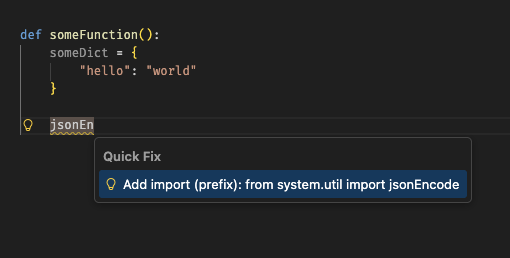
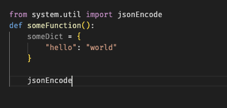
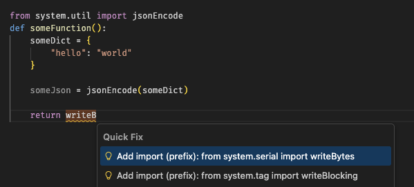
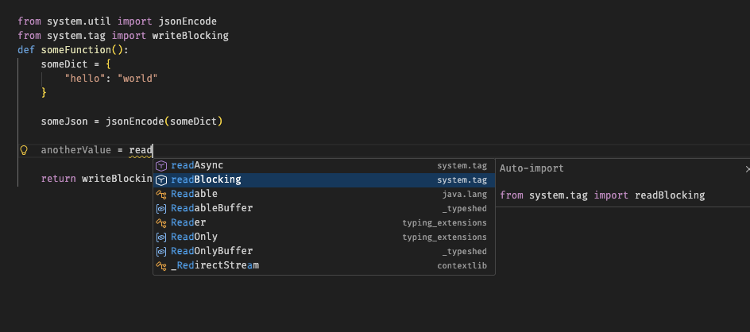
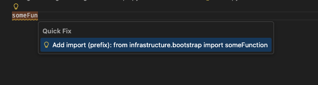

# Ignition Sift (VS Code Extension)

Barebones, stub-driven auto-imports for Ignition scripting projects.

## Motivation
After using [Ignition Flint](https://github.com/keith-gamble/ignition-flint) for the past year, I no longer use the lack-luster script editor baked into the ignition designer.
Ignition Sift aims to improve the developer experience by automatically adding imports in the `Quick Fix` menu. This extension remedies the need to always type out the absolute path where the developer can simply auto import the function. See [Getting Started](#getting-started) for more details.

## Features
- Stub generation
	- On save
	- Bulk generation
	- Ignition `system` stubs
- Offers deterministic auto-imports via `ctrl+.`
- No LSP required

## Requirements
- Stub Generation
	- python3 >=
- Pyright

## Getting Started

### Install the extension
Ignition Sift can be installed on the [vscode marketplace](https://marketplace.visualstudio.com/items?itemName=nburnet1.ignition-sift), [openvsx registry](https://open-vsx.org/extension/nburnet1/ignition-sift), or the [releases page](https://github.com/nburnet1/ignition-sift/releases)

### Configuration Defaults
```json
{
  "ignitionSift.stubGenerator": "builtin", // Can pass in your own python file that generates the code for you.
  "ignitionSift.stubDir": ".stubs", // Stubs directory location
  "ignitionSift.pythonPath": "python3", // Binary for your python interpreter
  "ignitionSift.generateStubsOnSave": true, // Keeps stubs up to date once you save a code.py
  "ignitionSift.maxImportSuggestions": 15 // Keeps the quick fix decluttered by capping how many suggestions. 

}
```

### Requirement: Install Pyright
Ignition Sift relies on the flags that `pyright` raises in order to provide the `Quick Fix` menu. `pyright` is essentially a typing checker that provides very limited LSP functionality. Support for Python 2.7 (much less Jython) has been removed for `jedi` and is extremely limited for `pylance` hence why we are using `pyright`. For more information on `pyright` click [here](https://github.com/microsoft/pyright).

Ignition Sift should prompt you to download `pyright`.

### Pyright Config `pyrightconfig.json`
Below is the recommended config for `pyright`.

_Note: changing the stubs directory in Ignition Sift means you will need to change it in the pyright config_
```json
{
  "include": ["."],
  "extraPaths": ["./.stubs"],
  "typeCheckingMode": "off",
  "reportMissingImports": true,
  "reportMissingModuleSource": false
}
```
### Usage

#### Commands `ctrl+shift+p`

On a new project, you will want to run both `initStubs` and `generateAllStubs`.

_Note: for stub generator, there is a [builtin generator](https://github.com/nburnet1/ignition-sift/blob/main/python/builtin_stubgen.py) that I provide. but you can pass in your own. With this in mind, This extension can run code outside of vscode as we are calling a python binary._

- `ignitionSift.initStubs`
	- Adds the ignition native stubs to your `.stubs` directory
- `ignitionSift.generateAllStubs`
	- Looks through entire project to find `code.py` files and then generates stubs (YMMV for project inheritance)

#### Auto Import
Ignition Sift tries its best to stay out of the way. Pyright will be doing most of the work once a module has actually been imported. To get auto import suggestions, use `ctrl+.` on an [`undefined variable`](https://github.com/microsoft/pyright/blob/main/docs/configuration.md#reportUndefinedVariable). _Note: the lookup is case insensitive._

#### Example

**Import System Function**



_Relative path added at top of file_



**Multiple Options**




_Once imported, pyright can take over in suggesting more functions and classes in the specific package._




**User Created Function Reference**

Once a file has been saved and a stub generated, we then can immediately auto import the code.




### Ignition Flint
As mentioned in the [motivation](#motivation), I have been using Ignition Flint for a while and it has worked beautifully and allowed us to offload the development to an external editor. You will be recommended to download Ignition Flint but it is by no means required. Just a great extension!

#### Ignition Flint Example Config (Workspace)
To ensure the same DX for all developers, you should create a `.code-workspace` file where you can store configurations across environments. Ignition Sift's configurations and many others can be stored this way.

```json
		"ignitionFlint.ignitionGateways": [
			{
				"label": "localhost",
				"address": "http://localhost:80",
				"projectPaths": [
					"/var/ignition-poc/ignition/global"
				],
				"forceUpdateDesigner": true,
				"updateDesignerOnSave": true,
				"supportsProjectScanEndpoint": true,
			}
		],
```

#### Showing script name
Since all python files are `code.py`, you can also create a custom label in your `.code-workspace` file in the `settings` key. This shows the package name rather than the `code.py`.


```json
		"workbench.editor.customLabels.enabled": true,
		"workbench.editor.customLabels.patterns": {
			"**/script-python/**/code.py": "${dirname}"
		},
```

#### Sidebar: Install Project Scan Endpoint (8.1 dependency)
To get the most out of Ignition **Flint**, installing the project scan endpoint will enable the gateway to show your changes in realtime.

[Project Scan Endpoint](https://github.com/bw-design-group/ignition-project-scan-endpoint/releases/download/v0.0.4/Project-Scan-Endpoint.modl)


# Disclaimer
Ignition Sift is an independent, unofficial VS Code extension and 
is not affiliated with, endorsed by, or sponsored by 
Inductive Automation.
